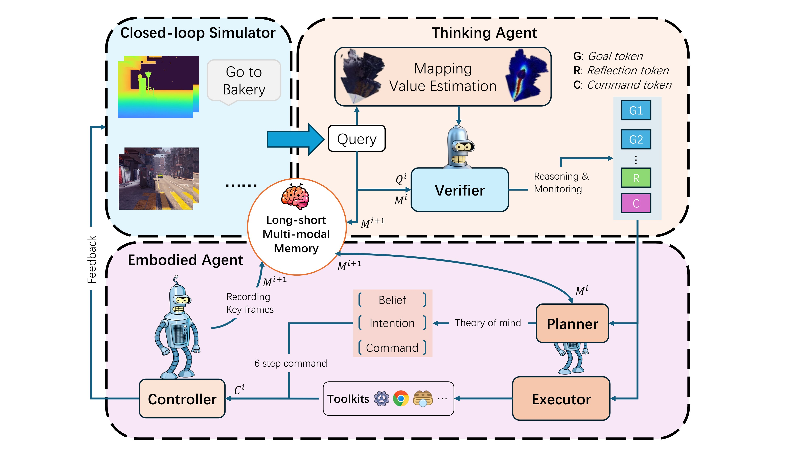

<a name="readme-top"></a>

<h3 align="center">
FreeAskAgent: Human Cognition-inspired Zero-Shot Vision-Language Navigation in Dynamic Environments
</h3>


## 🌟 Why FreeAskAgent?
FreeAskAgent is a **trainable, tool-integrated agentic framework** designed to overcome the **scalability** and **generalization limits** of today’s tool-augmented reasoning approaches and embodied ai agent framework. 

Unlike prevailing approaches such as [Search-R1](https://github.com/PeterGriffinJin/Search-R1) which train a **single LLM** to interleave reasoning steps with tool calls, **FreeAskAgent** introduces a **modular agentic system** with four specialized modules: **Planner**,  **Verifier**,  **Executor**.

<!-- For effective planning and tool use, the framework directly **optimizes planner agent within the system** in an **online fashion** using **Flow-based Group Refined Policy Optimization (Flow-GRPO)**, achieving superior performance across diverse domains with improved tool-calling reliability and long-horizon reasoning capabilities. -->



## 🚀 Key Features

- 🧩 **Modular Agentic System** – Four specialized agent modules (**Planner**, **Executor**, **Verifier**, **Generator**) that coordinate via evolving memory and integrated tools across multiple turns.  
- 🔗 **Multi-Tool Integration** – Seamlessly connect with diverse tool ecosystems, including `base_generator`, `python_coder`, `google_search`, `wikipedia_search`, `web_search`, `Grounded_SAN2`,  and more.  
- 🎯 **Flow-GRPO Algorithm** – Enables **in-the-flow agent optimization** for **long-horizon reasoning tasks** with sparse rewards.

## 📑 Table of Contents
- [⚙️ Setup](#️-setup)
  - [Installation](#installation)
  - [Setup Environment Variables](#setup-environment-variables)
- [⚡ Quick Start on FreeAskAgent Inference](#-quick-start-on-FreeAskAgent-inference)
- [💥 Quick Start on FreeAskAgent Flow-GRPO Training](#-quick-start-on-FreeAskAgent-flow-grpo-training)
  - [(Optional) Test Your Environment](#optional-test-your-environment)
  - [Dataset Preparation](#dataset-preparation)
  - [Flow-GRPO Training](#flow-grpo-training)
- [🎯 FreeAskAgent Benchmark](#-FreeAskAgent-benchmark)
- [🧩 Use Your Own Model in FreeAskAgent](#-use-your-own-model-in-FreeAskAgent)
- [🤝 Core Contributors](#-core-contributors)
- [🎓 Advisors](#-advisors)
- [🙏 Acknowledgements](#-acknowledgements)
- [🚀 Contributing](#-contributing)

## ⚙️ Setup

### Prerequisites
- **Python 3.11** (recommended)
```
bash setup.sh  # set up environment automatically
git submodule update --init --recursive  # Download submodule

cd closed_loop/ros2_agent_baseline.md # If you want to set up ros2 version, follwing this readme step
cd closed_loop/ros2.md
```
### Installation
```bash
bash setup.sh
source .venv/bin/activate
# (Optional) Install `parallel` for running benchmark experiments in parallel:
sudo apt-get update
sudo apt-get install parallel
```

Install Low Level Module from low_level/NavDP/README.md

### Setup Environment Variables
Copy the `.env.template` file from `FreeAskAgent/.env.template` and rename it to `.env`, then place it in the `FreeAskAgent/` folder. Update the following variables with your own API keys:
- `OPENAI_API_KEY` (for judging reasponse)
- `GOOGLE_API_KEY` (for Google Search tool)
- `DASHSCOPE_API_KEY` (for calling Qwen-2.5-7B-Instruct as engine for agents and tools)
- `TOGETHER_API_KEY` (alternative for calling Qwen-2.5-7B-Instruct as engine for agents and tools - recommended for international users)
- More ways: serve Qwen2.5-7B-instruct model with vLLM (details refer to [`serve_vllm_local.md`](assets/doc/serve_vllm_local.md)).

Please check [API Key Setup Guide](assets/doc/api_key.md) for detailed instructions on how to obtain these keys.

```bash
cp FreeAskAgent/.env.template FreeAskAgent/.env
# Then edit FreeAskAgent/.env with your API keys
```

## ⚡ Quick Start on FreeAskAgent Inference 
FreeAskAgent provides a modular agentic system with **four specialized modules** (planner, executor, verifier, generator) that coordinate through **evolving memory** and a **toolkit** over **multiple turns** to solve complex reasoning tasks. 

To quickly experience the system in action, run the command below (don’t forget to set up your API key):
```python 
python quick_start_embodied.py
```

## 💥 Quick Start on FreeAskAgent Flow-GRPO Training 
For effective planning and tool use, the framework directly **optimizes the planner agent within the system in an online fashion using Flow-GRPO**. Below is a quick start for training.
<!-- 
### (Optional) Test Your Environment
Before diving in, we recommend verifying that FreeAskAgent's tools, LLM engines, and network configuration are properly set up. See [test_env.md](assets/doc/test_env.md) for detailed testing instructions. -->

<!-- 
### Dataset Preparation
We mix two datasets for training: [NQ (Natural Questions)](https://huggingface.co/datasets/RUC-NLPIR/FlashRAG_datasets) for agentic search and [DeepMath-103K](https://huggingface.co/datasets/zwhe99/DeepMath-103K) for mathematical reasoning. -->
<!-- 
```bash
# train data
python data/get_train_data.py
# validation data
python data/aime24_data.py
```

After that, data dir should be:
```
data/
├── train/
│   └── combined_train.parquet (182,190 samples)
├── val/
│   └── aime24.parquet (30 samples)
├── aime24_data.py
└── get_train_data.py
``` -->

### Flow-GRPO Training 
Start FreeAskAgent training using Flow-GRPO with tmux:
```bash
# Create tmux session and start FreeAskAgent service (Window 0)
tmux new-session -s FreeAskAgent
bash train/serve_with_logs.sh

# Create new window (Ctrl+B then C) and start training (Window 1)
bash train/train_with_logs.sh
```

**Configuration:**
All training hyperparameters are in [`train/config.yaml`](train/config.yaml) (model settings, tools, RL parameters, resources, etc.)

**Logging:**
We provide a comprehensive logging to monitor training. See [logs.md](assets/doc/logs.md) for more details.


## 🎯 FreeAskWorld Benchmark 
Communicationn with FreeAskWorld based on ROS2, main pack in closed_loop/ros2/src/vln_connector.
Run benchmark, start simulator at first, then:
```bash
bash closed_loop/ros2server.bash # Then start the FreeAskWorld simulator
```

## Run other baselines on FreeAskWorld
[Vint](https://github.com/wksports/FreeAskWorld_Vint_Baseline.git)

[InstructNav](https://github.com/Sinewin/freeaskworld_instructnav_baseline)

## 🧩 Use Your Own Model in FreeAskAgent

FreeAskAgent supports different LLM engines for each agent module. See [llm_engine.md](assets/doc/llm_engine.md) for supported models and [`factory.py`](FreeAskAgent/FreeAskAgent/engine/factory.py) for the corresponding `model_string` configuration:

**Planner Agent:**
- Modify the `llm_engine_name` parameter in [`test/exp/run_all_models_all_datasets.sh`](test/exp/run_all_models_all_datasets.sh)

**Other Agents (Executor, Verifier, Generator):**
- By default, these agents use a fixed LLM engine (Qwen-2.5-7B-Instruct via DashScope)
- To use your own model, modify `self.llm_engine_fixed` in [`FreeAskAgent/FreeAskAgent/models/planner.py:19`](FreeAskAgent/FreeAskAgent/models/planner.py#L19):
```python
self.llm_engine_fixed = create_llm_engine(model_string="your-engine", is_multimodal=False, temperature=temperature)
```
and

- Modify the `llm_engine_name` parameter in the Executor instantiation from [`FreeAskAgent/FreeAskAgent/solver.py:232`](FreeAskAgent/FreeAskAgent/solver.py#L232):
```python
# Instantiate Executor
executor = Executor(
    # llm_engine_name=llm_engine_name,
    llm_engine_name="dashscope",
    root_cache_dir=root_cache_dir,
    verbose=verbose,
    # base_url=base_url,
    temperature=temperature
)
```
- For detailed information on supported engines and `model_string` formats, see [`llm_engine.md`](assets/doc/llm_engine.md)


## Acknowledgement
FreeAskAgent is built upon **[AgentFlow](https://github.com/lupantech/AgentFlow)** and **[RTAB-Map](https://github.com/introlab/rtabmap)**. We sincerely thank the developers of these projects for their significant contributions, which made this work possible.