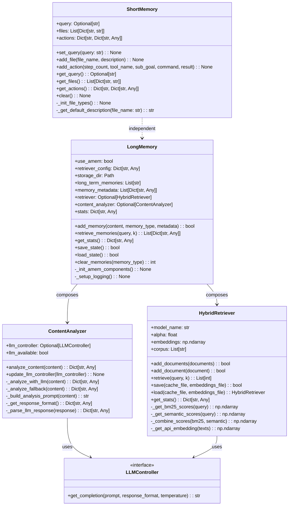
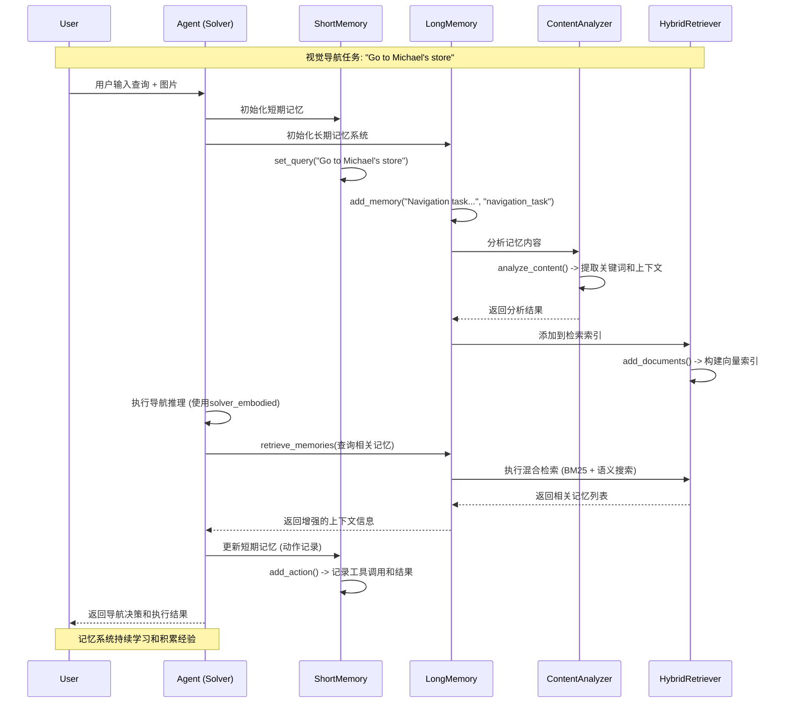

# 技术设计方案

## 1. 架构设计

### 整体架构
Embodied Agent的记忆系统采用分层架构设计，将记忆功能分为短期记忆和长期记忆两个独立模块：

```
models_embodied/
├── short_memory.py          # 短期记忆管理类
├── long_memory.py           # 长期记忆管理类
├── content_analyzer.py      # 内容分析器
├── hybrid_retriever.py      # 混合检索器
├── llm_controllers.py       # LLM控制器
└── md/
    ├── requirement.md       # 需求文档
    ├── design.md           # 技术设计文档
    └── task.md             # 实现计划
```

### 文件职责划分
- **short_memory.py**: 负责当前会话的查询、文件和动作管理，提供基础的记忆容器功能
- **long_memory.py**: 负责跨会话的长期记忆存储、检索和管理，集成A-MEM增强功能
- **content_analyzer.py**: 使用LLM进行内容分析，提取关键词、上下文和标签
- **hybrid_retriever.py**: 实现BM25和语义搜索相结合的混合检索系统
- **llm_controllers.py**: 提供统一的LLM接口，支持多种后端

## 2. Class and Interface Design (Class Diagram)



## 3. 交互流程

### 记忆系统启用时的序列图



### 核心决策：关于hybrid_retriever和content_analyzer的强制迁移

**决策结果：必须迁移** (非可选)

**强制迁移理由：**
1. **功能依赖性**：长期记忆系统的核心功能（混合检索、内容分析）完全依赖于这两个组件，是A-MEM系统的核心组成部分
2. **架构完整性**：这两个模块是Embodied Agent记忆系统的关键组件，移除将导致系统功能完全失效
3. **性能和质量保证**：A-MEM系统的核心价值体现在智能检索和内容分析能力上，必须完整迁移以保持系统性能
4. **向后兼容性**：现有代码深度集成了这些组件，是系统正常运行的必要条件

**重要声明：**
- `content_analyzer.py` 和 `hybrid_retriever.py` 是本次迁移的**强制要求**
- 不得以任何形式简化或移除这两个模块的核心功能
- 迁移过程中必须保持其完整性和独立性

## 3. Detailed Migration Strategy

### Short Memory (合并逻辑)
1. **核心逻辑提取**：
   - 从`memory.py`提取`Memory`类的核心功能
   - 保持原有的查询、文件、动作管理接口
   - 保留文件类型识别和描述生成功能

2. **接口兼容性**：
   - 保持与现有系统的完全兼容
   - 所有原有的getter/setter方法保持不变
   - 支持相同的参数格式和返回值类型

3. **冲突处理**：
   - 合并重复的辅助方法
   - 统一错误处理机制
   - 保持代码风格一致性

### Long Memory (提取逻辑)
1. **功能提取**：
   - 从`agentic_memory_system.py`提取长期记忆相关功能
   - 保留A-MEM系统的检索和分析能力
   - 保持持久化和统计功能

2. **依赖迁移**：
   - 同时迁移`content_analyzer.py`和`hybrid_retriever.py`
   - 保持原有的配置和初始化逻辑
   - 维护向后兼容性

3. **接口重构**：
   - 简化初始化参数，移除不必要的配置项
   - 提供更清晰的记忆管理API
   - 增强错误处理和日志记录

### 辅助模块强制迁移
1. **ContentAnalyzer迁移** (强制)：
   - 必须完整迁移LLM分析功能
   - 保留降级机制以确保可靠性
   - 优化性能和错误处理
   - 保持与long_memory.py的接口兼容性

2. **HybridRetriever迁移** (强制)：
   - 必须完整保持BM25和语义搜索功能
   - 支持多种嵌入方式（API/本地）
   - 维护持久化能力
   - 确保检索性能不低于原有水平

### 配置和初始化
- 提供统一的配置接口
- 支持环境变量和配置文件
- 实现延迟初始化以提高启动性能
