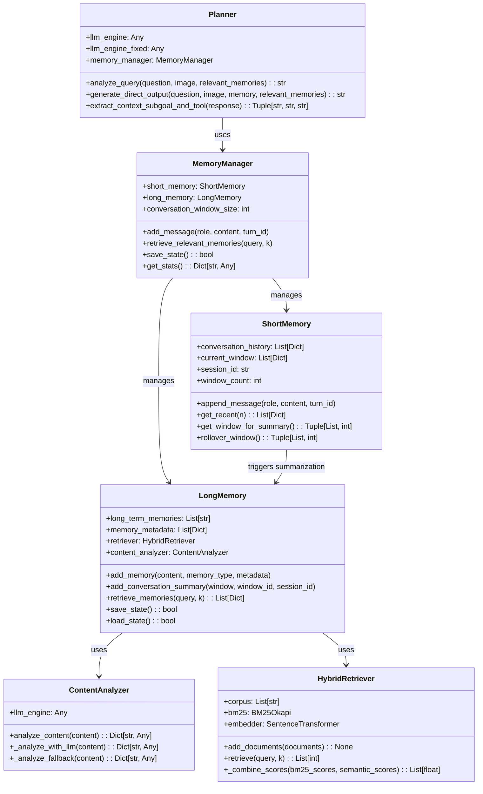
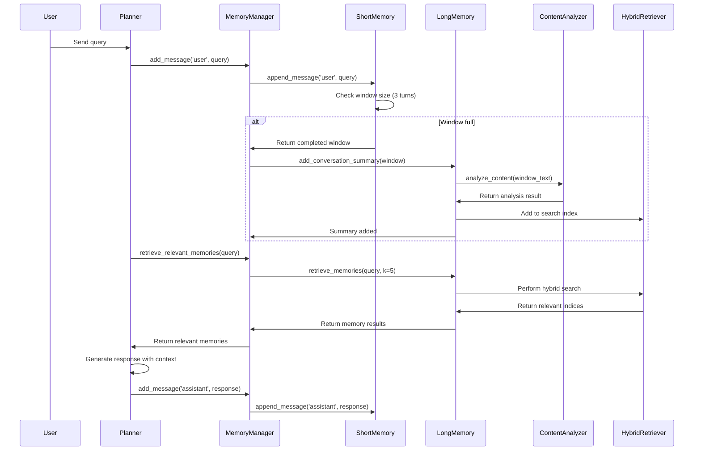

# Technical Design Document

## 1. System Architecture

### 整体架构
FreeAskAgent Embodied Agent 模块采用分层架构设计，集成了完整的记忆系统、外部化prompt管理和统一的LLM调用：

```
models_embodied/
├── planner.py              # 规划器 - 核心业务逻辑
├── executor.py             # 执行器 - 工具调用执行
├── initializer.py          # 初始化器 - 工具和配置管理
├── formatters.py           # 格式化器 - 数据结构定义
├── memory/                 # 记忆系统目录
│   ├── __init__.py
│   ├── short_memory.py     # 短期记忆 - 当前会话管理
│   ├── long_memory.py      # 长期记忆 - 跨会话存储和检索
│   ├── content_analyzer.py # 内容分析器 - LLM驱动的内容分析
│   ├── hybrid_retriever.py # 混合检索器 - BM25+语义搜索
│   └── memory_manager.py   # 记忆管理器 - 协调短期和长期记忆
├── prompts/                # Prompt模板目录
│   ├── __init__.py
│   ├── vln.py             # VLN任务prompts
│   ├── query_analysis.py  # 查询分析prompts
│   ├── final_output.py    # 最终输出prompt构建器
│   ├── content_analysis.py # 内容分析prompts
│   ├── tom.py             # Theory of Mind prompts
│   ├── *.txt              # 外部化prompt模板文件
│   └── *.py               # Prompt构建函数
└── md/                    # 文档目录
    ├── requirement.md     # 需求文档
    ├── design.md          # 技术设计文档
    └── task.md            # 实现任务文档
```

### 模块职责划分
- **Planner**: 负责查询分析、工具规划和最终输出生成，集成记忆检索
- **MemoryManager**: 协调短期和长期记忆，管理对话窗口和自动总结
- **ShortMemory**: 管理当前会话的对话历史、查询、文件和动作记录
- **LongMemory**: 提供跨会话的持久化记忆存储和智能检索
- **ContentAnalyzer**: 使用LLM分析记忆内容，提取关键词和上下文
- **HybridRetriever**: 实现BM25和语义向量混合检索算法
- **Prompts**: 外部化所有prompt模板，支持文件加载和变量替换

## 2. Data Structures and Interfaces

### 核心数据结构

```python
# 对话消息结构
ConversationMessage = {
    'role': str,           # 'user' | 'assistant'
    'content': str,        # 消息内容
    'timestamp': float,    # 时间戳
    'turn_id': str,        # 对话轮次ID
    'session_id': str,     # 会话ID
    'window_id': int       # 窗口ID
}

# 记忆摘要结构
MemorySummary = {
    'content': str,        # 摘要内容
    'original_content': str,  # 原始内容
    'analysis': Dict[str, Any],  # 内容分析结果
    'type': str,           # 记忆类型 ('conversation_summary')
    'timestamp': float,    # 创建时间
    'metadata': Dict[str, Any]  # 元数据
}

# 检索结果结构
RetrievalResult = {
    'content': str,        # 记忆内容
    'metadata': Dict[str, Any],  # 元数据
    'index': int           # 在记忆库中的索引
}
```

### 类图设计



## 3. System Workflow

### 记忆管理流程



### Prompt加载流程

```mermaid
graph TD
    A[Planner需要prompt] --> B[调用prompt构建函数]
    B --> C[build_xxx_prompt()]
    C --> D[_load_prompt_template()]
    D --> E[从prompts/*.txt读取文件]
    E --> F[模板变量替换]
    F --> G[返回完整prompt字符串]
```

## 4. LLM Integration Design

### 调用层次结构
```
Embodied Agent Layer (planner.py, content_analyzer.py)
    ↓
Engine Layer (engine/factory.py, engine/*.py)
    ↓
LLM Provider Layer (OpenAI, Anthropic, etc.)
```

### 设计原则
1. **统一入口**: 所有LLM调用通过 `engine.factory.create_llm_engine()` 创建实例
2. **职责分离**: Embodied层专注于prompt组装和结果处理，不实现底层调用逻辑
3. **配置驱动**: LLM引擎选择和参数通过配置参数控制
4. **错误处理**: 各层都有适当的错误处理和降级机制

### 接口规范
```python
# LLM引擎接口
class LLMEngine:
    def __init__(self, model_string: str, **kwargs): ...
    def __call__(self, input_data: List[Any], **kwargs) -> Any: ...

# Embodied层使用模式
llm_engine = create_llm_engine("gpt-4o", temperature=0.0)
response = llm_engine([prompt_text, image_bytes], response_format=SomeFormat)
```

## 5. Configuration and Deployment

### 配置参数
```python
memory_config = {
    'conversation_window_size': 3,      # 对话窗口大小
    'max_files': 100,                   # 最大文件数
    'max_actions': 1000,                # 最大动作数
    'storage_dir': './memory_store',    # 记忆存储目录
    'max_memories': 1000,               # 最大记忆数
    'retriever_config': {               # 检索器配置
        'use_api_embedding': True,
        'alpha': 0.5  # BM25 vs 语义权重
    }
}

llm_config = {
    'engine_name': 'gpt-4o',           # 主LLM引擎
    'fixed_engine_name': 'dashscope',   # 固定引擎
    'temperature': 0.0,                # 生成温度
    'max_tokens': 4000                 # 最大token数
}
```

### 部署考虑
1. **内存管理**: LongMemory支持持久化，避免每次重启重新构建索引
2. **性能优化**: HybridRetriever使用缓存的embeddings和BM25索引
3. **可扩展性**: MemoryManager支持配置化的参数调整
4. **监控**: 完整的统计信息和性能指标收集
